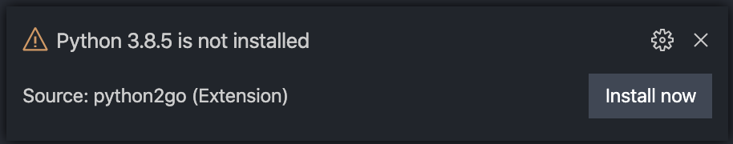

# GBSL Informatik VS Code Extension Pack


Install the extension from the [Marketplace](https://marketplace.visualstudio.com/items?itemName=lebalz.ispw-programming-basics).

This extension pack adds the following vs code plugins:

- [Git2Go](https://marketplace.visualstudio.com/items?itemName=lebalz.git2go)
- [Python2Go](https://marketplace.visualstudio.com/items?itemName=lebalz.python2go)
- [Python](https://marketplace.visualstudio.com/items?itemName=ms-python.python)
- [Markdown Preview Github Styles](https://marketplace.visualstudio.com/items?itemName=bierner.markdown-preview-github-styles)
- [Git Graph](https://marketplace.visualstudio.com/items?itemName=mhutchie.git-graph)
- [Python Test Adapter](https://marketplace.visualstudio.com/items?itemName=LittleFoxTeam.vscode-python-test-adapter)
- [Test Explorer](https://marketplace.visualstudio.com/items?itemName=hbenl.vscode-test-explorer)
- [Code Runner](https://marketplace.visualstudio.com/items?itemName=formulahendry.code-runner)

And installs the following pip packages (once python is installed):

- [pylint](https://pypi.org/project/pylint)
- [flake8](https://pypi.org/project/flake8)
- [autopep8](https://pypi.org/project/autopep8)
- [pytest](https://pypi.org/project/pytest)
- [matplotlib](https://pypi.org/project/matplotlib)
- [jupyter](https://pypi.org/project/jupyter)
- [ipython](https://pypi.org/project/ipython)
- [numpy](https://pypi.org/project/numpy)
- [scipy](https://pypi.org/project/scipy)
- [pandas](https://pypi.org/project/pandas)
- [termcolor](https://pypi.org/project/termcolor)
- [smartphone-connector](https://pypi.org/project/smartphone-connector)
- [pyfiglet](https://pypi.org/project/pyfiglet)
- [cowsay](https://pypi.org/project/cowsay)
- [inquirer](https://pypi.org/project/inquirer)
- [gTTS](https://pypi.org/project/gTTS)
- [playsound](https://pypi.org/project/playsound)
- [pynput](https://pypi.org/project/pynput)

## Installation

You will see popping up some error/information messages pointing out that some dependencies (Python) are not installed on your system.

To install, e.g. the needed `python` version, click `Install Now` on the following message:



Or you can install over the command palette:

- View > Command Palette... > `Python2Go: Install`
    - **windows**: you may be prompted to allow vs code running powershell with administrator privileges.
    - **osx**: you may be prompted for your user password

Then restart your vs code and start using it 🎉

## Develop

### Publish

```sh
vsce package && vsce publish
```